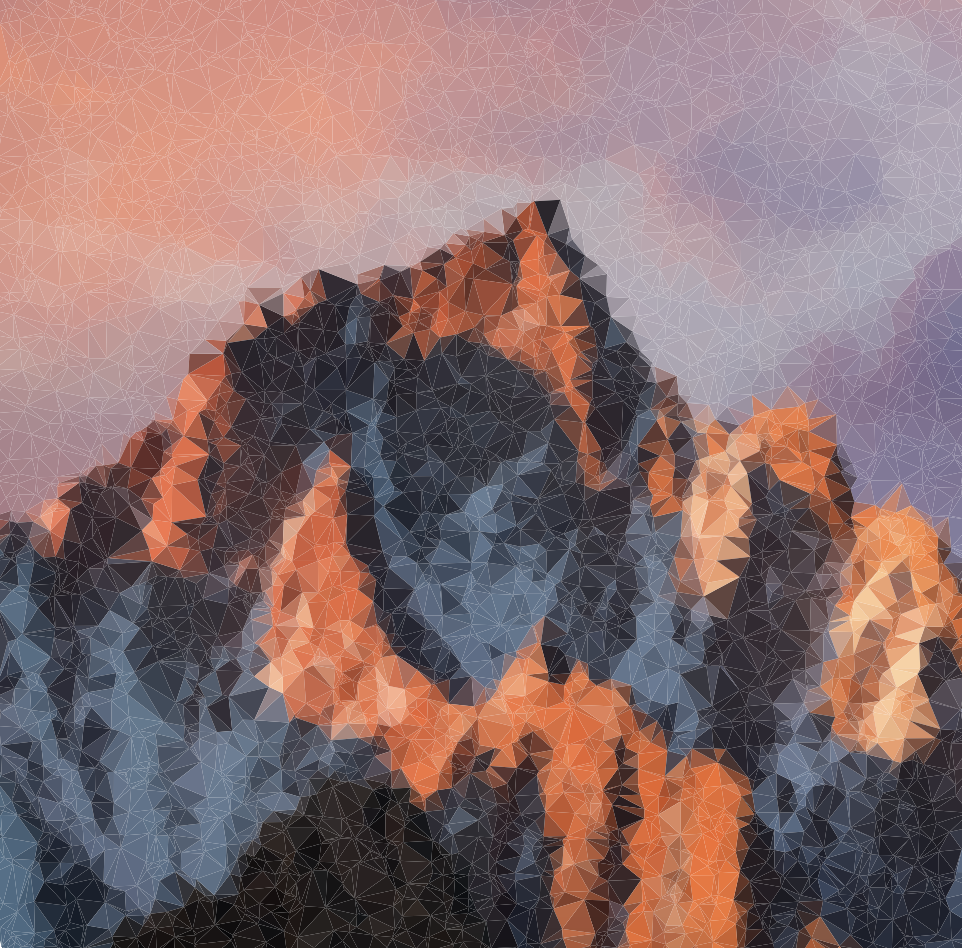

# Triangulate
<p>This project uses a <a href="https://github.com/d3/d3/blob/master/API.md#voronoi-diagrams-d3-voronoi" target="_blank">Voronoi Diagram</a> to randomly sample points from an image to construct an abstracted representation of it. It was built based on <a href="https://bl.ocks.org/mbostock/4341156">this example</a> that expresses the Delaunay Triangulation used to compute a Voronoi Diagram. Simple controls allow you to specify the number of triangles, as well as blur the original photo.  </p>

Hexagon, circle, and smoothing functionality built by <a href="https://scholar.google.com/citations?user=247cncgAAAAJ" target="_blank">Alex Rand</a>.

Some examples:




## Updating project
This project is a React application built with [create-react-app](https://github.com/facebookincubator/create-react-app). To begin create a local version, you should fork + clone the project, then install necessary packages using `npm install` in your project directly. Then, you can run a development server using `npm start` in your project directory. To deploy your project to a `gh-pages` branch, simply run `npm run deploy` in the root of your project directory. The project is organized into the following Components (and files).

### `App.js`
The root of the application, the `<App>` component manages the overall **state** of the application and passes necessary **properties** to child components. The state of the application is largely driven the by `<ControlPanel>` on the left hand side, though the **App manages the state**. It renders two `<canvas>` elements -- one to sample from (`id="canvasCopy"`) and one to draw the complex image (see `<CustomCanvas>`).

### `ControlPanel.js`
The `<ControlPanel>` component renders the [material-ui](http://www.material-ui.com/#/) components on the screen. The status of each control is controlled by the state of the `<App>` component (the `<ControlPanel>` simply _displays_ the state of the application, which is passed to the `<ControlPanel>` via **props**). The set of components to diplay is contained in the `ControlSettings.js`.

### `ControlSettings.js`
The `ControlSettings.js` file contains a JSON object to describe the rendering of the controls. The `<ControlPanel>` uses the properties of each object to determine what type of _material-ui_ element to render (i.e., a `<Slider>`, `<SelectField>`, `<CheckBox>`, etc.).

### `CustomCanvas.js`
This element draws a rendering of the original image depending on the settings chosen in the `<ControlPanel>`. The `<App>` passes this information as _properties_ to the `<CustomCanvas>` object. 

### `PolygonUtils.js`
This module exports an object that has _pure functions_ (i.e., they will always return the same outputs based on their inputs, and don't depend on and global variables). These functions include:

- `area`: Compute the area of a polygon, given an array of its points
- `centroid`: Compute the **centroid** of a polygon, given an array of its points. 
- `getCentroids`: A helper function to get the centroids of an array of polygons
- `getImageOffset`: Given a point (pt = [x, y]) find the offset in the pixel array where the rgba is

It also has the following smoothing algorithms (used in `Resampler.smoothSites()`). Each one takes in as parameters an array of points and a Voronoi diagram object (from `d3.voronoi`), then re-samples the array of points to be more evenly distributed:
- `getLaplacianSites`: Uses _Laplacian_ method, which moves a site to the average of its neighboring sites.
- `getPolygonVertex`: Uses _Polygon Vertex_ method, which moves a site to the average of the vertices of the Voronoi polygon.
- `getCentroids`: Uses the _Lloyd_ method, which moves sites to their polygon centroids.

### `RectangleUtils.js`
This modules also exports an object that has pure functions, including:

- `fillRectangles`: Recursive function for subdividing rectangles until each one contains a single site in the input sites list.
- `getSplitLocation`: Compute some kind of middle point between a minimum and maximum value used to encapsulate some randomization in the rectangular subdivision process.
- `swapSites`: Helper function for swapping two objects in an arrray of objects.s

### `ColorUtils.js`
Using a slightly different approach, `ColorUtils.js` leverages a **closure** to have locally scoped variables (this is because many of the functions depend on the same information, such as the `width` and `height`). The module exports a **function that returns an object** which has many methods on it. It is implemented in `CustomCanvas.js` as follows:

```js
// Reset color utils
// returns object with necessary functions
// use getter setter functions to set locally scoped variables
this.colorUtils = ColorUtils() 
    .height(this.props.colorSettings.height) 
    .width(this.props.colorSettings.width)
    .fillColor(this.props.colorSettings.fillColor)
    .threshold(this.props.colorSettings.threshold)
    .blackWhite(this.props.colorSettings.blackWhite)
    .invert(this.props.colorSettings.invert);
```

In addition to the getter/setter methods shown above, the `ColorUtils` function returns an object with the following properties (functions):
  
- `makeColorString`: A simple helper function for other functions to get the string RBGA value
- `getDotColor`: Given a point (`pt`) and a radius (`r`), return the color for a dot
- `getColor`: Given a polygon (`p`) return it's color
- `getAverageColor`: Get the average color in an area (given a centroid and polygon)
- `getColorAtPos`: Get the color at a specific position (centroid)

Before using these, the `setSrcCanvas` method is employed to set the source Canvas being used. 

### `Resampler.js`
This module leverages a **class** that enables re-sampling. The `App` leverages the `Resampler` class to generate the set of points and polygons used by the `CustomCanvas` component to render the image. The properties of the `resampler` object are updated using these methods:

- `updateValues`: Takes an **object** of parameters to update (i.e., `width`, `height`, etc.)
- `updateSmoother`: Takes an **object** of parameters to update related to smoothing

Once the values are set, the `resampler` class generates a **set of points** using the `getPolygons()` method. This is dependent on other class methods:
  
- `setVoronoi`: Define the voronoi diagram using d3.js
- `setSites`: Set the (initial) set of coordinates to sample from the image
- `smoothSites`: Using an algorithm from `PolygonUtils`, re-sample for a more even distribution of points.

Note, the `setSites` function uses other methods for re-sampling for contrast (namely, `approximateGradient`). The polygons generated by the `resampler` class as passed as a **property** to the `CustomCanvas` component in the `App`. 


## Related work 
For a more robust command line tool that creates triangulated images, see [this project](https://github.com/esimov/triangle).