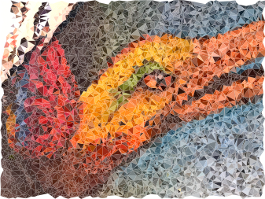
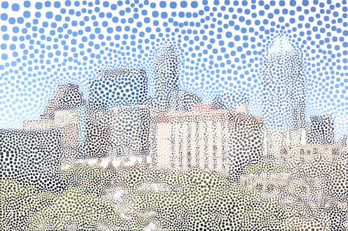

# Triangulate

This project uses a <a href="https://github.com/d3/d3/blob/master/API.md#voronoi-diagrams-d3-voronoi" target="_blank">Voronoi Diagram</a> to randomly sample points from an image to construct an abstracted representation of it. It was built based on <a href="https://bl.ocks.org/mbostock/4341156">this example</a> that expresses the Delaunay Triangulation used to compute a Voronoi Diagram. Simple controls allow you to specify the number of triangles, as well as blur the original photo. Blur effect is done with <a href="https://github.com/flozz/StackBlurStackBlur">this library</a>.

Hexagon, circle, and smoothing functionality built by <a href="https://scholar.google.com/citations?user=247cncgAAAAJ" target="_blank">Alex Rand</a>.

Some examples:

## Updating project
This project is a React application built with [create-react-app](https://github.com/facebookincubator/create-react-app). To begin create a local version, you should fork + clone the project, then install necessary packages using `npm install` in your project directly. Then, you can run a development server using `npm start` in your project directory. The project is organized into the following Components (and files).

### `App.js`
The root of the application, the `<App>` component manages the overall **state** of the application and passes necessary **properties** to child components. The state of the application is largely driven the by `<ControlPanel>` on the left hand side, though the **App manages the state**. It renders two `<canvas>` elements -- one to sample from (`id="canvasCopy"`) and one to draw the complex image (see `<CustomCanvas>`).

### `ControlPanel.js`
The `<ControlPanel>` component renders the [material-ui](http://www.material-ui.com/#/) components on the screen. The status of each control is controlled by the state of the `<App>` component (the `<ControlPanel>` simply _displays_ the state of the application, which is passed to the `<ControlPanel>` via **props**). The set of components to diplay is contained in the `ControlSettings.js`.

### `ControlSettings.js`
The `ControlSettings.js` file contains a JSON object to describe the rendering of the controls. The `<ControlPanel>` uses the properties of each object to determine what type of _material-ui_ element to render (i.e., a `<Slider>`, `<SelectField>`, `<CheckBox>`, etc.).

### `CustomCanvas.js`
This element draws a rendering of the original image depending on the settings chosen in the `<ControlPanel>`. The `<App>` passes this information as _properties_ to the `<CustomCanvas>` object. 

## Related work 
For a much more robust command line tool that creates triangulated images, see [this project](https://github.com/esimov/triangle).